## Sterberate
Es wird die Sterberate für demographische Gruppen berichtet.
Die Sterberate ist aufschlußreicher als die Anzahl an Toten, da sich in der Gesamtzahl an Verstorbenen Veränderungen der demographischen Zusammensetzung und der Sterberate vermischen.

(Die Plots werden generiert in [Sterberate.jl](Sterberate.jl).)

### Sterberate pro Monat mit gleitenden Jahresmittelwerten

- stark altersabhängig,
- steigt und fällt mit der Jahreszeit, vor allem mit höherem Alter,
- fällt für die meisten demographischen Gruppen ab 2000.

Positiv zeigt sich, dass die Gesamt-Sterberate älterer Bevölkerungsgruppen in den letzten Jahren immer weiter sinkt.

Auch wird deutlich, in welchen Jahren seit 2000 und wann in der Wintersaison Übersterblichkeit einer Gruppe zu beobachten war.

## Rhythmen der Sterberate
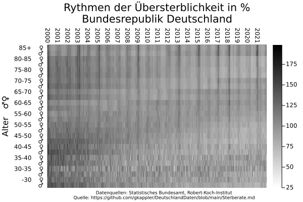

Die alters-spezifische Übersterblichkeit
- ist höher (schwärzer) um den Jahreswechsel ("Grippewelle") bis März im Rhythmus mit der Jahreszeit.
  Dieser Effekt zeigt sich vor allem in höherem Alter als vertikale Striche.
- Starke Winterübersterblichkeit über demographischen Gruppen vergleichbar zu 2021 zeigte sich in den Jahren 2003, 2005, 2009, 2013, 2015, 2017, 2018.
- Hitzewellen im Sommer sind bei genauer Betrachtung erkennbar.

### Dunkle und helle Schatten zeigen einen Effekt der Geburtsjahrgänge:
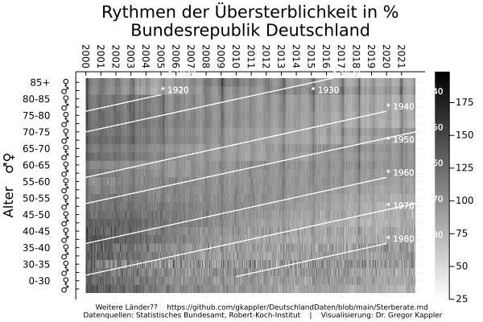

### Die Rhythmen der Sterberate: Bundesländer 
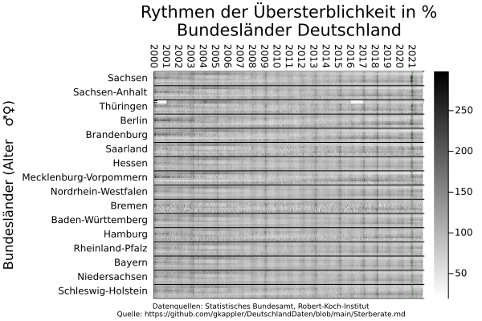
Im Plot sind die Bundesländer sortiert nach relativer Übersterblichkeit im Zeitfenster 6.2020-6.2021.

Die Sterberate wärend der pandemischen Lage seit 2020 zeigt sich 
- auffällig in einigen Bundesländern (Sachsen, Sachsen-Anhalt, Thüringen, Berlin, Brandenburg, ...) 
- nicht gleichzeitig über alle Bundesländer wie in den Jahren zuvor (grüne Linie) 

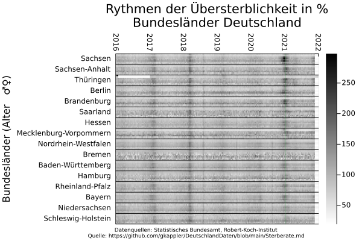

#### Unterschiede zwischen den Bundesländern
Innerhalb allen Bundesländerländer zeigt sich das ähnliche Bild einer abnehmenden Brutto-Sterberate für Personen über 85 seit 2000.
Die Gesamt-Sterberate für Personen über 85 ist von Bundesland zu Bundesland sehr verschieden (um den Faktor 10).
Dies kann viele Gründe haben.
In Ländern mit höherer Sterblichkeit könnten mehr sehr alte Menschen leben.
Die Gründe sind erklärungsbedürftig, z.B. warum in Bremen sogar mehr als 100% der über 85-jährigen pro Jahr sterben.

### Sterberate von 10 000 pro Kalenderwoche

## Sterberaten der Bundesländer

### Sterberate pro Jahr

### Sterberate pro Monat

### Sterberate pro Kalenderwoche
#### Sterberate 0-65
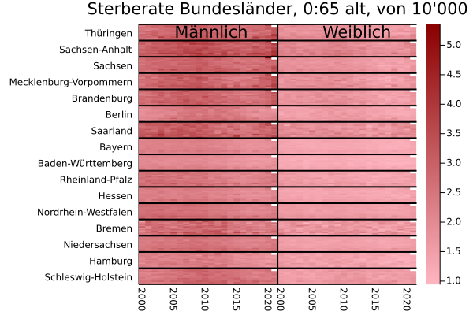

#### Sterberate 65-75
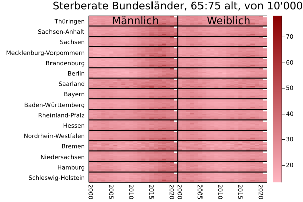

#### Sterberate 75-85
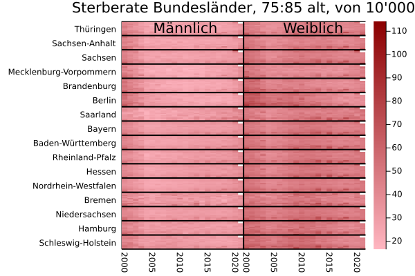

#### Sterberate 85+
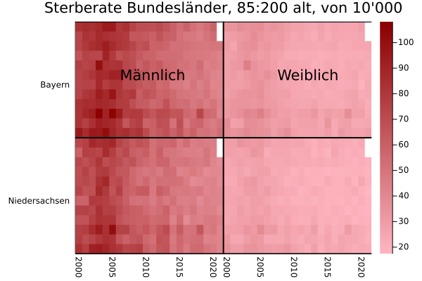
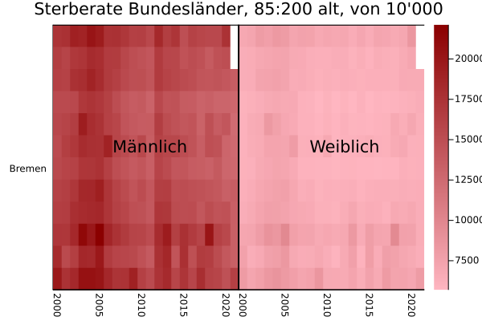

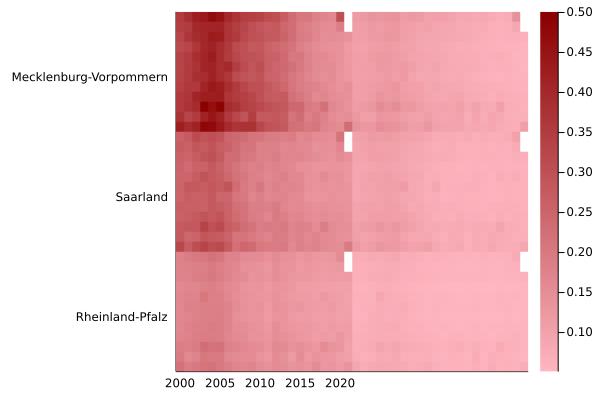
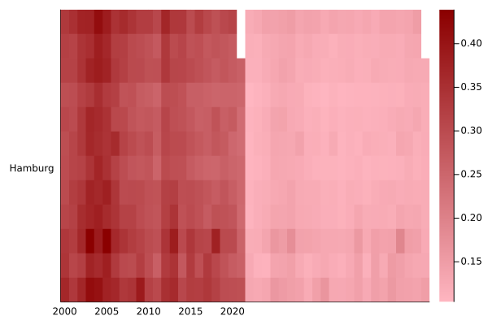

