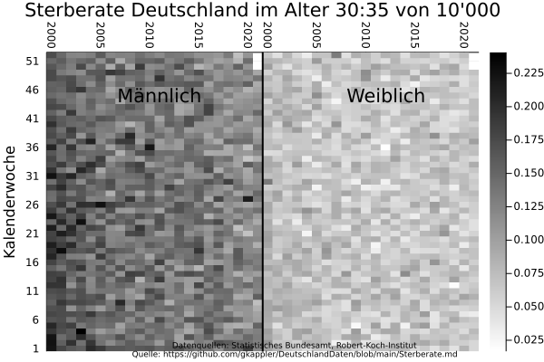
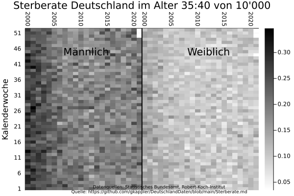
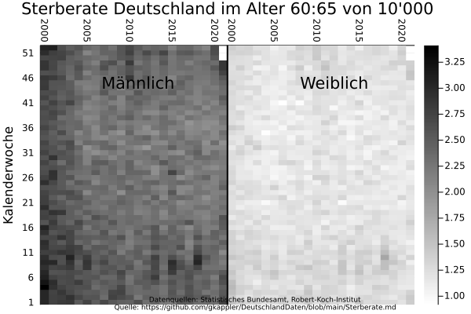
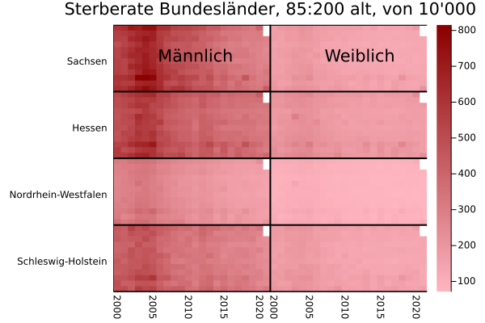
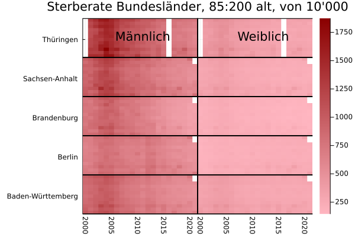
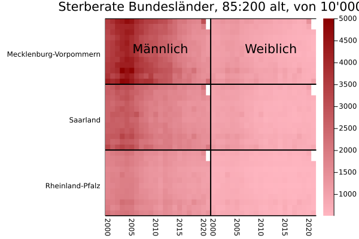
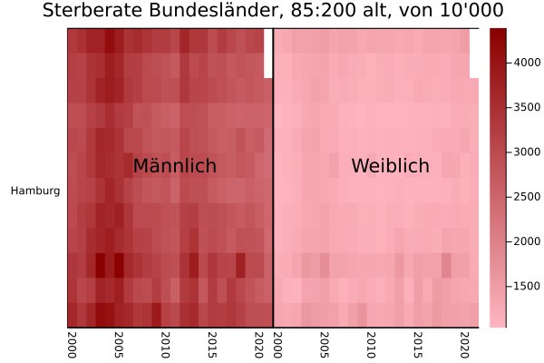

## Sterberate
Es wird die Sterberate für demographische Gruppen berichtet.
Die Sterberate ist aufschlußreicher als die Anzahl an Toten, in der sich Veränderungen der demographischen Zusammensetzung und der Sterberate vermischen.

(Die Plots werden generiert in [Sterberate.jl](Sterberate.jl).)

### Sterberate pro Monat mit gleitenden Jahresmittelwerten

- stark altersabhängig,
- steigt und fällt mit der Jahreszeit, vor allem mit höherem Alter,
- ändert sich von 2000 bis 2021.

Positiv zeigt sich, dass die Gesamt-Sterberate älterer Bevölkerungsgruppen in den letzten Jahren immer weiter sinkt.
Auch wird deutlich, in welchen Jahren seit 2020 Pandemien zu einer starken Übersterblichkeit der älteren Generation geführt haben:
in keinem.

## Veränderungen der Sterberate
Die alters-spezifische Übersterblichkeit
- ist höher (schwärzer) um den Jahreswechsel ("Grippewelle") bis März im Rhythmus mit der Jahreszeit.
  Dieser Effekt zeigt sich vor allem in höherem Alter als vertikale Striche.
- Starke Winterübersterblichkeit über demographischen Gruppen vergleichbar zu 2021 zeigte sich in den Jahren 2003, 2005, 2009, 2013, 2015, 2017, 2018.
- Hitzewellen im Sommer sind bei genauer Betrachtung erkennbar.

Dunkle und helle Schatten zeigen einen Effekt der Geburtsjahrgänge:

### Sterberate von 10 000 pro Kalenderwoche

## Sterberaten der Bundesländer

### Sterberate pro Jahr

### Sterberate pro Monat

### Sterberate pro Kalenderwoche
#### Sterberate 0-65

#### Sterberate 65-75

#### Sterberate 75-85

#### Sterberate 85+

