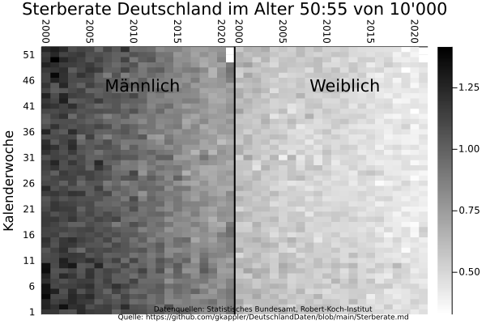
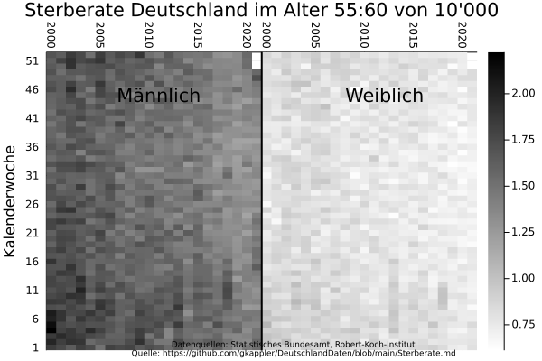
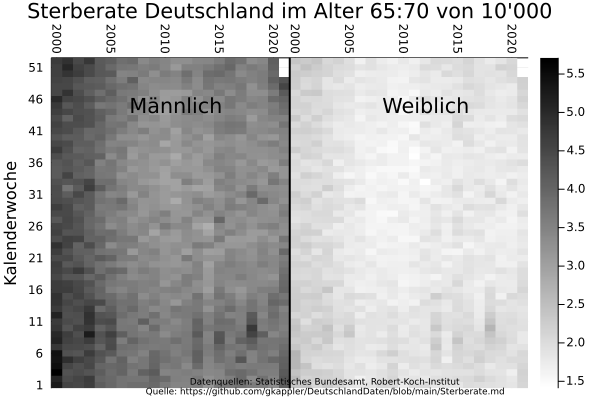
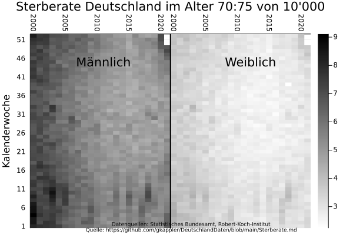
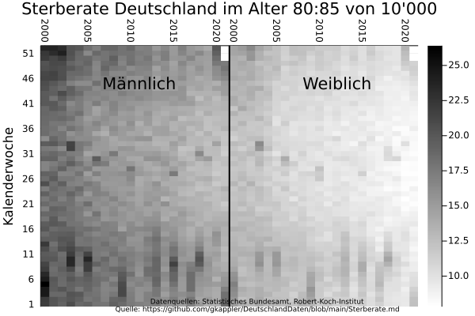

## Sterberate
Es wird die Sterberate für demographische Gruppen berichtet.
Die Sterberate ist aufschlußreicher als die Anzahl an Toten, in der sich Veränderungen der demographischen Zusammensetzung und der Sterberate vermischen.

Die Plots werden generiert in [Sterberate.jl](Sterberate.jl).

- stark altersabhängig,
- steigt und fällt mit der Jahreszeit, vor allem mit höherem Alter,
- ändert sich von 2000 bis 2021.

### Sterberate pro Jahr

### Sterberate pro Monat

### Sterberate von 10 000 pro Kalenderwoche
#### Sterberate von 10 000 im Alter 0-30

#### Sterberate von 10 000 im Alter 30-35

#### Sterberate von 10 000 im Alter 35-40

#### Sterberate von 10 000 im Alter 40-45

#### Sterberate von 10 000 im Alter 45-50

#### Sterberate von 10 000 im Alter 50-55

#### Sterberate von 10 000 im Alter 55-60

#### Sterberate von 10 000 im Alter 60-65

#### Sterberate von 10 000 im Alter 65-70

#### Sterberate von 10 000 im Alter 70-75

#### Sterberate von 10 000 im Alter 75-80

#### Sterberate von 10 000 im Alter 80-85

#### Sterberate von 10 000 im Alter 85+

## Veränderungen der Sterberate
Die alters-spezifische Übersterblichkeit
- steigt und fällt mit der Jahreszeit, vor allem mit höherem Alter,
- ändert sich von 2000 bis 2021.

### Sterberate pro Jahr

### Sterberate pro Monat

### Sterberate pro Kalenderwoche

## Sterberaten der Bundesländer
Die Sterberaten der älteren Bevölkerung unterscheidet sich stark zwischen den Bundesländern.

### Sterberate pro Jahr

### Sterberate pro Monat

### Sterberate pro Kalenderwoche
#### Sterberate 0-65

#### Sterberate 65-75

#### Sterberate 75-85

#### Sterberate 85+

Ich freue mich Euch mal wieder zu sehen.
Wie Ulrike, ich hatte zuviele online-meetings in meiner Vergangenheit.

Ich mache meine Hausaufgaben-Rechen-Projekte, 
freue mich sehr fokussiert über Zusammenarbeit.
Helfe sehr gerne, wenn ich persönlich angeschrieben werde.
Prioritäten verändern sich derzeit, und was tun...
Was verbindliches zuzusagen muss ich lange überlegen.

Ich will helfen offene Daten als unabhängiges Netzwerk.
Eher keine Plattform & Projektmanagement.

habe 2 konkrete Fragen:
1. Wo biete ich Euch meine Datenaufbereitung für Julia zur Nutzung an?
2. Wo finde ich eine Doku Eurer Daten, um sie ggf. als datadep in julia zu integrieren?

Vernetzung...

Ich nehme mal als Anregung, besser auf meiner Seite zusammenzustellen:

Ich suche:
3. Daten, Modelle und Code öffentlich diskutieren? Warum ein internes Wiki?
4. Ich bin halb zufrieden mit github pages, static sites in Julia... wo kann ich von Euch lernen?

Ich biete:
- Visualisierung
- Parsing

Ich biete
- Strategie: Ideen für offene kollektive Nutzung Dezentraler Daten
  - julia datadeps
- Methodik: 
  - Feedback bei Modellierung (Bayes), Kausalitätstheorie
  - Modellierung der Sterberate/Übersterblichkeit
- "Publikation", kann (Daten-)Anfragen über Thüringer Landtag 
