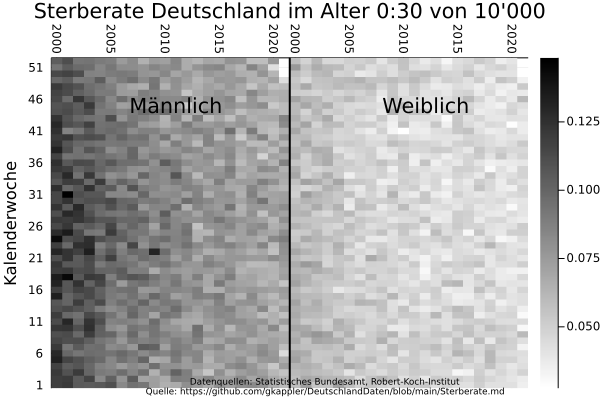
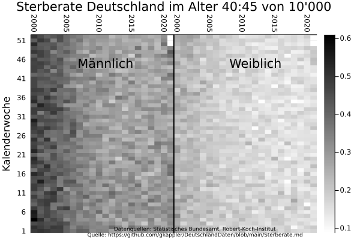
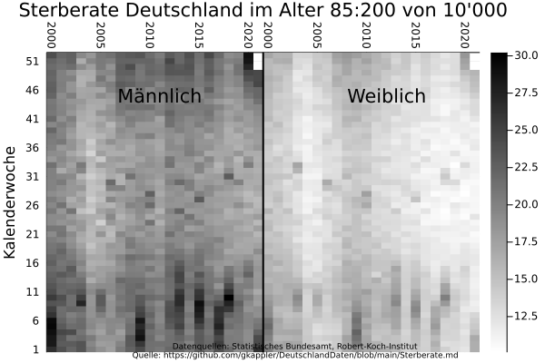

## Sterberate
Es wird die Sterberate für demographische Gruppen berichtet.
Die Sterberate ist aufschlußreicher als die Anzahl an Toten, in der sich Veränderungen der demographischen Zusammensetzung und der Sterberate vermischen.

Die Plots werden generiert in [Sterberate.jl](Sterberate.jl).

- stark altersabhängig,
- steigt und fällt mit der Jahreszeit, vor allem mit höherem Alter,
- ändert sich von 2000 bis 2021.

### Sterberate pro Monat im gleitenden Jahresmittel

### Sterberate pro Monat

### Sterberate von 10 000 pro Kalenderwoche

## Veränderungen der Sterberate
Die alters-spezifische Übersterblichkeit
- steigt und fällt mit der Jahreszeit, vor allem mit höherem Alter,
- ändert sich von 2000 bis 2021.

### Sterberate pro Jahr

### Sterberate pro Monat

### Sterberate pro Kalenderwoche

## Sterberaten der Bundesländer
Die Sterberaten der älteren Bevölkerung unterscheidet sich stark zwischen den Bundesländern.

### Sterberate pro Jahr

### Sterberate pro Monat

### Sterberate pro Kalenderwoche
#### Sterberate 0-65

#### Sterberate 65-75

#### Sterberate 75-85

#### Sterberate 85+

