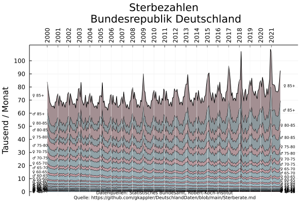
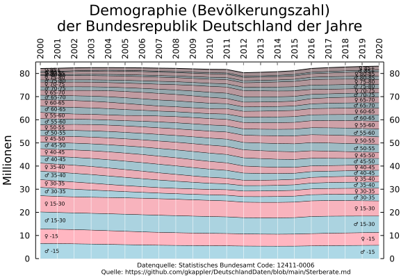
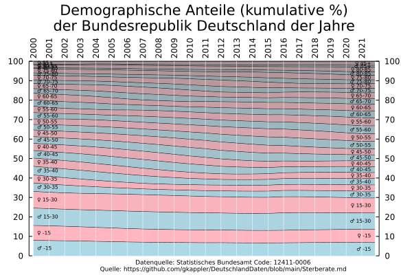
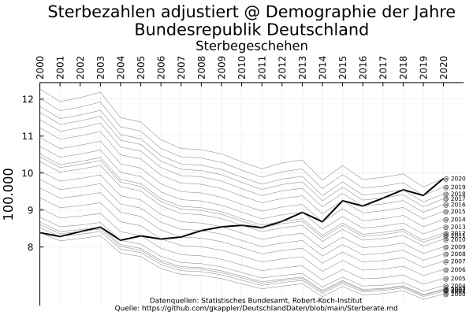
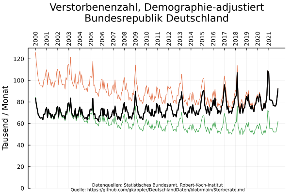
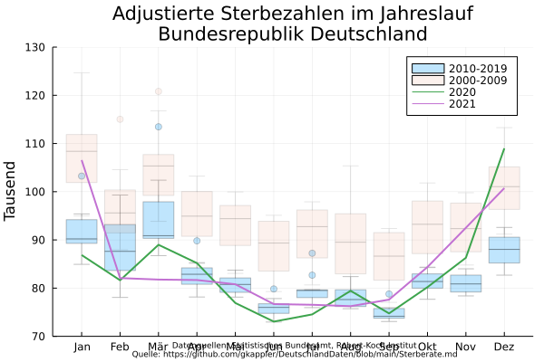

## Die Zahl Verstorbener zu einer Zeit 

Die Verstorbenenzahl wird bestimmt von Demographie und bedingten Sterbewahrscheinlichkeiten

### Demographischer Wandel

Übersterblichkeit ergibt sich nicht aus einem Wandel der Demographie

# Adjustierung

## Welche Monate der letzten Jahre zeigen Übersterblichkeit
nach Demographie adjustiert:

