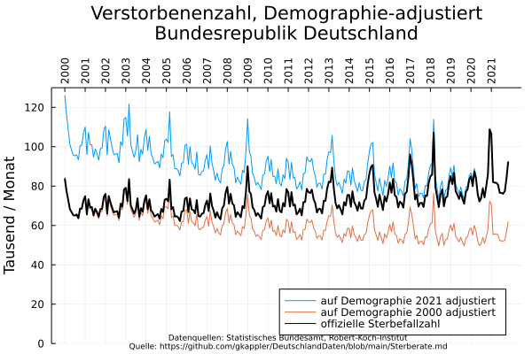

## Die Zahl Verstorbener zu einer Zeit 

Auf den ersten Blick steigt die Zahl Verstorbener pro Woche in Deutschland seit 2000.

Jedoch wird die Zahl Verstorbener bestimmt von 
1. Demographie (Alter / Geschlecht der Bevölkerung, etc.)
2. Sterbewahrscheinlichkeiten demographischer Gruppen.

### Demographischer Wandel

Die Bevölkerung in Deutschland altert im Schnitt, und auch die Bevölkerungsgröße unterliegt gesellschaftlichem Wandel:

# Adjustierung
Der Wandel der Demographie verfälscht im Blick auf die Verstorbenenzahl den Eindruck zur Übersterblichkeit!
(z.B. Eine doppelt so große Bevölkerung mag zwar doppelt so viele Tote beklagen, aber ist darum nicht doppelt so sterblich.)

Die Adjustierungen der Sterberaten auf Populationszahl und demographischen Verteilung jedes Jahrs seit 2020 zeigen:
1. Die Sterblichkeit sinkt in Deutschland
2. Die Pandemiejahre zeigen keine Auffälligkeit

Auch der Gipfelpunkt der Sterblichkeit im Winter seit Corona zeigt sich nicht erhöht über die anderen Jahre hinaus auffällig,
in feinerer zeitlicher Auflösung nach Monaten

und nach Wochen

## Welche Monate der letzten Jahre zeigen Übersterblichkeit
In Anordnung nach Jahreszeiten zeigt sich für Corona der Gipfelpunkt der Sterblichkeit im Winter auffällig früh

und im Jahre 2021 sind Wochen mit beachtlicher Übersterblichkeit ab November erkennbar.

